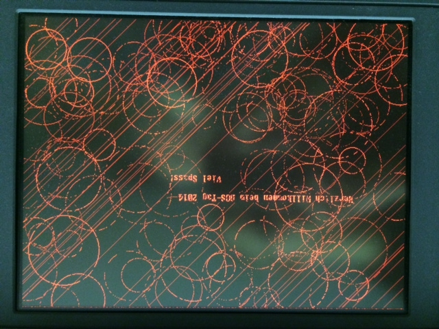
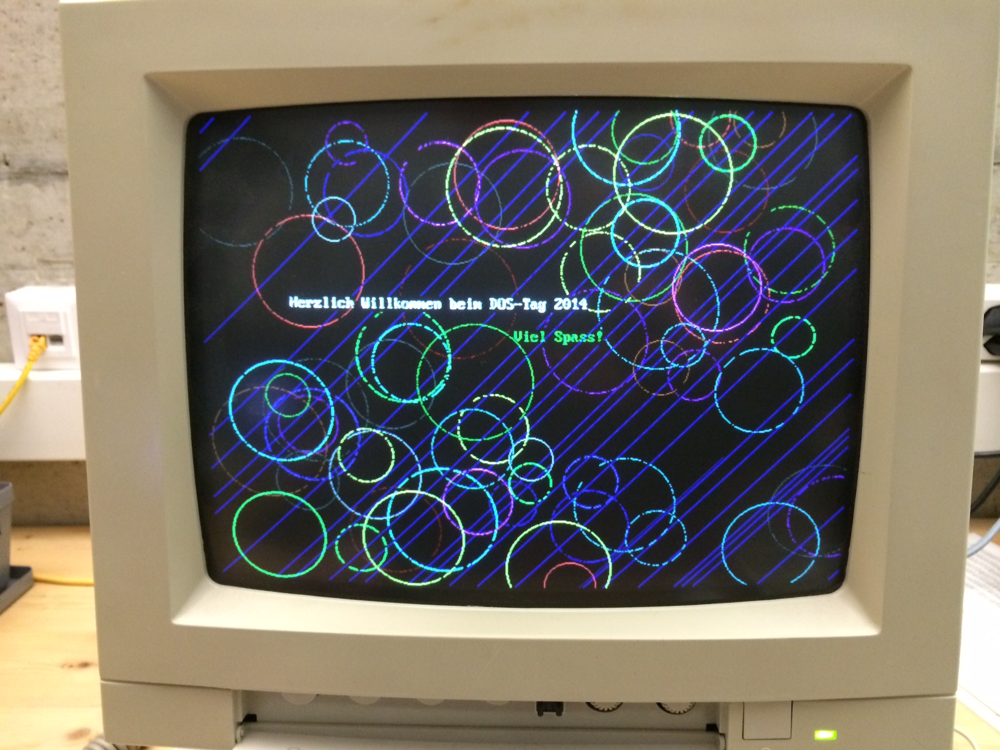

# QBasic demo – dos-day 2014

This is a [small demo](src/MAIN.BAS.TXT) written in QBasic. Coded by [Matthias Schwyn](https://www.weisspunkt.ch/) and [Stefan Huber](https://signalwerk.ch/) for dos-day 2014 in Schaffhausen (Switzerland). Every year, [ODENWILUSENZ](https://odenwilusenz.ch/) hosts a meeting about old computers and retro stuff. It took us nearly as long to code the demo as it did to transfer the file to an Internet-enabled computer.

## Setup

### Hardware

- Toshiba T5200/100
- Intel 80386 CPU, 20 MHz
- 92 856 320-byte hard disk
- 4096 KB of memory

### Software

- Microsoft MS-DOS 6.20
- Microsoft MS-DOS QBasic v1.1
- Norton Commander, version 4.0

## Video

- [vine](https://web.archive.org/web/20240108214443/https://vine.co/v/MzHeHHhau90)
- [video](https://cdn.jsdelivr.net/gh/signalwerk/dos-day-2014@master/doc/demo.mp4)

## Impressions

## License

MIT License
